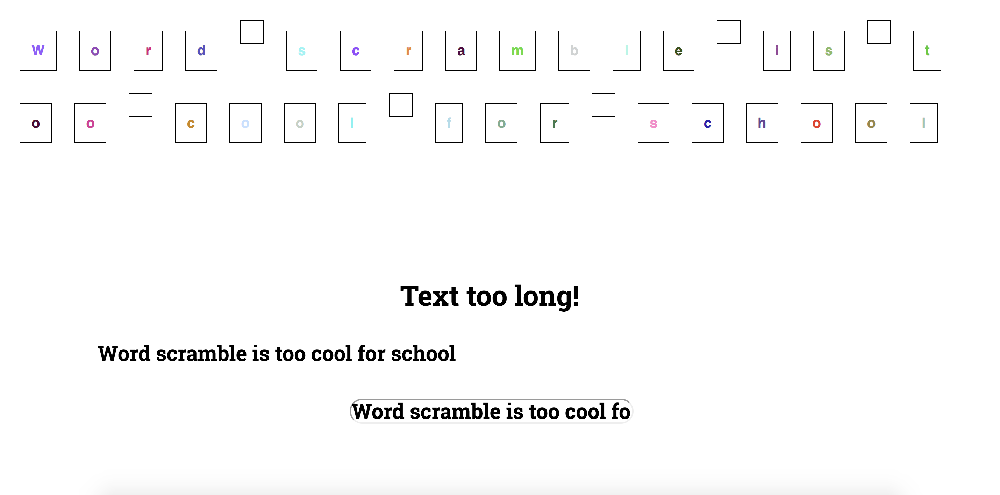

# List and Conditionals 



This was a React exercise from a Udemy course to understand list and conditionals. The last step definitely is a killer and the new thing that I learnt is this syntax

 props.inputLength > 5 ?
<p> Text too long! </p> : <p> Text too short! </p>

The semi colon says if true, put too long else, put too short.

Cool exercise to go through and then obviously went crazy with the styling. 

## How To Use (Hope I'm right)

1. Clone the repo
```
git clone https://github.com/thatdania/WordScramble.git
```
2. Change the project folder directory
```
cd WordScramble
```

3. Npm install (just in case)
```
npm install
```

4. Npm start to get it going, to give it a try
```
Give it a try 
```

## Instructions 

- Create an input field (in App Component) with a change listener which outputs the length of the entered text below 

- Create a new component (=> ValidationComponent) which reveals the text length as a prop 

- Inside the Validate Component either output "Text too short" or "text too long depending on the text length (min = 5)

- Create another component (=> Charcomponent) and style it as an inline block (=> display: inline block, padding: 16px, text-align: center, margin: 16px, border: 1px solid black)

- Render a list of CharComponenets where each CharComponent receives a different letter of entered text (in the initial input field ) as a prop 

- When you click a Char component, it should be removed from the entered text

Tips : Javascript strings are basically arrays. 